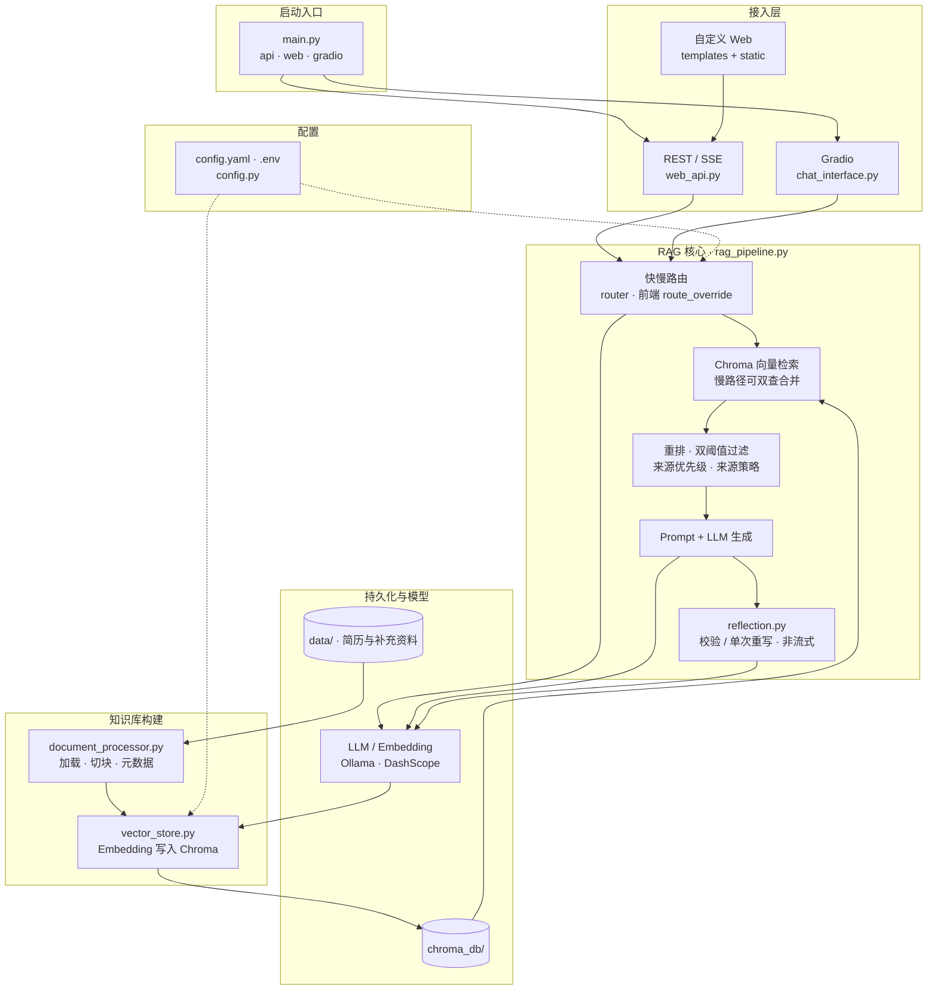

# 个人面试助手项目设计文档

## 0. 项目简介

我设计了一个“个人面试助手”项目，核心是让系统严格基于简历与补充资料回答问题。技术上使用 FastAPI + LangChain + Chroma，模型支持 Ollama 和 DashScope 双 Provider。为解决“答非所问/查不到简历内容”的真实问题，我实现了双阈值过滤、来源优先级和来源策略识别，并加入了无证据拒答机制。整体系统支持 API/Web/Gradio 三种交互方式，具备可演示、可部署、可恢复的完整工程特性。

**项目截图：**


## 1. 项目定位与目标

本项目是一个基于 RAG（Retrieval-Augmented Generation，检索增强生成）的个人面试助手系统。  
核心目标是：在模拟面试场景中，系统优先基于候选人简历与补充资料进行检索，再由大模型生成结构化回答，避免“脱离资料的泛化回答”。

面向面试展示时，这个项目重点体现了以下能力：
- RAG 端到端工程落地能力（文档处理、向量索引、检索策略、生成链路、前后端集成）
- 多模型/多服务商适配能力（Ollama 与 DashScope 双 Provider）
- 质量控制能力（阈值过滤、来源优先级、来源策略约束、防幻觉兜底）
- 可部署能力（FastAPI 服务化 + Gradio 快速演示 + 自定义 Web 页面）

## 2. 功能全景

### 2.1 核心功能

- 文档知识库构建：支持从 `data` 目录递归加载 `.txt/.md/.pdf/.docx` 文件，自动分块后写入 Chroma 向量库。
- 面试问答：用户输入问题后执行“检索 -> 过滤 -> 优先级排序 -> 来源策略约束 -> 生成回答”。
- 证据可追溯：返回 `relevant_sources`，包含来源文件、来源类型、分块 ID、相关度分数。
- 无依据拒答：当检索结果不足时，固定返回“根据当前知识库内容，无法回答该问题”，避免幻觉回答。
- 知识库刷新：提供 API 后台刷新能力，支持知识库重建。

### 2.2 交互方式

- FastAPI 接口模式（推荐生产/联调）
- 自定义 Web 页面模式（`templates/index.html` + `static/js/chat.js`）
- Gradio 模式（快速演示、低门槛本地体验）

## 3. 技术栈与选型理由

### 3.1 后端与编排

- Python 3.11
- FastAPI + Uvicorn：轻量高性能 API 服务框架
- LangChain：统一组织 LLM、Embedding、Prompt、Runnable 链路
- Pydantic：配置结构化建模与类型安全

### 3.2 模型与向量能力

- LLM：
  - `OllamaLLM`（本地推理，适合离线/低成本）
  - `ChatTongyi`（阿里百炼 DashScope，适合云端高可用）
- Embedding：
  - `OllamaEmbeddings`
  - `DashScopeEmbeddings`
- 向量数据库：
  - Chroma（本地持久化、快速集成）

### 3.3 文档处理与前端

- 文档加载：
  - `TextLoader`（txt/md）
  - `PyPDFLoader`（pdf）
  - `python-docx`（docx，绕开 `docx2txt` 依赖问题）
- 前端：
  - 自定义 HTML/CSS/JavaScript
  - Gradio 4.36.1 作为备用交互层

## 4. 系统架构设计

### 4.1 系统架构总览图

下图从**接入方式**、**在线问答链路**与**离线建库链路**三部分概括当前实现（反思仅在非流式 `POST /api/query` 中启用；流式接口不走反思）。



### 4.2 模块划分

- `main.py`：启动入口，支持 `api/web/gradio` 模式与 `--init-kb` 初始化开关
- `src/config.py`：统一配置中心（配置文件 + 环境变量覆盖）
- `src/document_processor.py`：文档加载、切块、来源标签注入
- `src/vector_store.py`：向量库创建/加载、相似度检索、异常恢复
- `src/rag_pipeline.py`：检索增强生成主流程与策略控制
- `src/web_api.py`：REST API 与流式接口
- `src/chat_interface.py`：Gradio 交互封装

### 4.3 数据流（核心问答链路）

1. 用户提问进入 API 或 UI。
2. 执行相似度检索（Top-K）。
3. 执行双阈值过滤（简历阈值更宽松）。
4. 执行来源优先级排序（简历 > 补充资料 > 其他）。
5. 识别提问意图并执行来源策略（如“仅简历”或“偏补充资料”）。
6. 若无有效证据，直接拒答；否则组装上下文送入 LLM。
7. 返回答案与可追溯证据片段。

### 4.4 文档处理策略

- 切块参数：`chunk_size=800`, `chunk_overlap=150`
- 分隔符：`["\n\n", "\n", "。", "；", "，", " ", ""]`
- 元数据增强：
  - `source`
  - `source_path`
  - `source_type`（`resume/additional/other`）
  - `source_priority`（1/2/99）
  - `chunk_id`

## 5. 检索与回答质量控制设计

### 5.1 双阈值过滤

- 默认阈值：`vector_store.relevance_threshold`（当前 0.35）
- 简历阈值：`min(default_threshold, 0.15)`

设计动机：简历表达通常更“事实化、碎片化”，语义匹配分数可能偏低；若使用统一阈值会误拒答。

### 5.2 来源优先级

- 默认排序：`resume > additional > other`
- 当识别到“非简历诉求”时：`additional > resume > other`

### 5.3 来源策略识别

根据问题中的语言模式识别策略：
- `resume`：如“根据简历/基于简历/按简历”
- `additional`：如“不要根据简历/不基于简历”，或通用“产品经理角色/职责/方法论”问题
- `default`：混合策略

### 5.4 防幻觉机制

- Prompt 强约束 + 检索前置过滤双保险
- 当无直接证据时固定拒答，不做常识补全

## 6. 配置体系与运行模式

### 6.1 配置优先级

1. 默认配置（`SystemConfig`）
2. `config.yaml`
3. `.env` 环境变量覆盖（最高优先级）

关键覆盖项：
- `MODEL_PROVIDER`
- `MODEL_LLM`
- `MODEL_EMBEDDING`
- `DASHSCOPE_API_KEY`
- `APP_NAME`
- `RESUME_FILE`

### 6.2 模型 Provider 切换

- 本地模式：`provider=ollama`
- 云模式：`provider=dashscope`

项目已将 LLM 与 Embedding 的初始化都做了 provider 级分流，切换只需改配置，不需改业务代码。

### 6.3 启动方式

- API 模式：`python main.py --mode api`
- Web 模式：`python main.py --mode web`
- Gradio 模式：`python main.py --mode gradio`
- 首次/重建知识库：追加 `--init-kb`

## 7. API 设计（对外能力）

核心接口如下：
- `GET /api/health`：健康检查
- `GET /api/status`：运行状态（含 provider:model）
- `POST /api/query`：标准问答
- `POST /api/query/stream`：流式问答（SSE）
- `GET /api/knowledge-base/info`：知识库统计信息
- `POST /api/knowledge-base/refresh`：后台刷新知识库
- `GET /api/models/available`：当前模型配置

返回结构统一包含：
- `answer`
- `relevant_sources`
- `source_count`
- `status`
- `timestamp`

## 8. 异常与稳定性设计

### 8.1 Chroma Schema 兼容恢复

针对历史出现的 `no such column: collections.topic`：
- 检测到 schema 不兼容异常后，自动清理旧持久化目录
- 清空 `SharedSystemClient` 缓存，避免旧连接复用
- 自动重建索引，降低手工介入成本

### 8.2 向量维度不一致防护

当 Embedding 模型切换（如 768 -> 1536）导致维度不一致时，通过重建向量库恢复一致性。

### 8.3 配置文件污染自愈

`config.py` 中实现了配置净化逻辑：
- 检测重复拼接段落
- 保留有效配置
- 自动回写为标准单份 YAML

## 9. 工程亮点

- **多 Provider 抽象**：统一接口兼容本地推理与云模型服务，具备实际生产迁移价值。
- **检索策略工程化**：不是“只做向量检索”，而是叠加阈值、优先级、策略识别，显著提升命中体验。
- **轻量重排已落地**：已实现基于相似分、词汇重合与来源偏好的启发式重排，在不增加额外模型依赖的前提下提升召回质量。
- **防幻觉闭环**：Prompt 约束 + 证据不足拒答 + 来源回溯。
- **可运维性**：知识库可刷新、状态可观测、异常可恢复。
- **多界面交互**：API、Web、Gradio 三种运行路径，适配开发演示与部署。

## 10. 当前局限与后续可演进方向

### 10.1 当前局限

- 来源策略识别主要基于关键词规则，复杂语义场景下仍可能误判。
- 检索阶段已实现轻量启发式重排，但暂未接入 Cross-Encoder 等神经重排模型，长文档下 Top-K 精度仍有提升空间。
- 会话记忆较轻量，暂未形成多轮语义状态管理。

### 10.2 演进方向

- 引入神经重排模型（Cross-Encoder Reranker 或云端 rerank API）进一步提升检索精度。
- 增加多轮会话上下文管理与面试追问策略。
- 增加“回答评分 + 改写建议”模块，形成面试训练闭环。
- 支持面试岗位模板化配置（产品/研发/运营等）。

详细的分阶段设计与模块落地方案见 **第 11 章**。

---

## 11. 缺失能力补齐与演进设计方案

本章针对当前实现中**尚未覆盖**的能力点（快慢思考、广义意图理解、工具调用、任务规划、反思，以及检索侧的进一步强化），给出可落地的架构设计与实施顺序。原则：**在现有 `RAGPipeline` + Chroma 主干上增量扩展**，用配置开关控制是否启用 Agent 层，避免一次性重写。

### 11.1 能力缺口与优化目标对照

| 能力 | 当前状态 | 优化目标 |
|------|----------|----------|
| 快慢思考 | 无显式双路径，固定单次检索-生成 | 引入**路由器**：简单/高频_query 走低延迟路径；复杂/多约束_query 走扩展路径 |
| 意图理解 | 仅「来源策略」resume/additional/default | 扩展为**任务类型**（事实检索、模拟面试官追问、自我评估、跨文档对比等），输出结构化意图对象 |
| 工具调用 | 无 | 将检索、按 ID 取块、列举来源等封装为 **Tool**，由模型按需调用 |
| 任务规划 | 无 | **Plan-and-Execute** 或受限步数 **ReAct**：子问题分解 → 逐步子检索/工具 → 汇总生成 |
| 反思 | 无 | **生成后校验**：主张与引用片段一致性检查；失败则触发补充检索或限定重试 |
| 向量检索与重排 | 向量相似度 + 启发式重排 | 可选接入 **Cross-Encoder / 云端 Rerank API**；可选 **混合检索（BM25+向量）** |

### 11.2 快慢思考（路由层）

**思路**：不把「慢思考」做成全程慢模型，而是**仅在路由器判定需要时**增加规划、多跳检索或反思。

- **快路径（默认）**：沿用现有链路——会话增强问题 → `similarity_search` → 阈值过滤 → 启发式重排 → LLM 生成。适用于：单跳事实问答、明确指向简历句子的提问。
- **慢路径**：在快路径之前或之后插入附加阶段：
  - 意图结构化（一次短 JSON 调用）；
  - 或 Plan（子查询列表）→ 多次检索合并去重；
  - 或 Tool 循环（见 11.4）；
  - 最后可选反思（见 11.6）。

**路由器输入**：当前用户问题 + 最近 `memory_window` 轮摘要（已有会话压缩可复用 `_build_effective_question` 的逻辑）。

**路由器输出建议字段**：`route` ∈ {`fast`, `slow`}，`reason`（简短），`confidence` ∈ [0,1]。

**实现要点**：

1. **规则优先**：例如含「分几步 / 对比 / 总结项目里所有」等触发 `slow`；纯「根据简历介绍某一段」维持 `fast`。
2. **低置信度回退**：LLM 路由器输出置信度不足时强制 `fast`，避免拖慢全站。
3. **预算**：`slow` 路径限制最大 LLM 轮次与最大检索次数，防止延迟与费用失控。

### 11.3 意图理解（从来源策略到任务语义）

在保留现有 `_detect_source_policy` 的同时，新增一层 **InterviewIntent**（名称可自定），例如：

- `source_policy`：继承现有 resume / additional / default。
- `task_type`：如 `factual_qa` | `behavioral_star` | `role_play_interviewer` | `self_assessment` | `compare_or_summarize`。
- `constraints`：如必须引用量化指标、禁止推断等（与现有 Prompt 强约束对齐）。

**落地方式**：单独短 Prompt 或小分类模型输出 JSON；与现有 hybrid 模式一致——**规则兜底 + LLM 仅在开启时参与**。配置文件可增加 `conversation.enable_task_intent` 与 `task_intent_mode`。

下游用法：`task_type` 决定 System Prompt 片段模板（例如模拟面试官 vs 简历事实问答）；`source_policy` 仍驱动 `_apply_source_policy`。

### 11.4 工具调用（Tool Calling）

**目标**：让模型在「慢路径」或复杂意图下能显式调用能力，而不是把所有内容塞进一次检索。

建议最小工具集（与面试 RAG 强相关）：

| 工具名 | 作用 |
|--------|------|
| `search_knowledge` | 封装现有 `similarity_search` + 过滤重排（参数：query, k, source_filter） |
| `get_chunk_context` | 按 `chunk_id` 或文件+偏移拉取完整块（补全列表截断） |
| `list_knowledge_sources` | 返回当前库内文件名与类型，便于「你有哪些资料」类问题 |

可选扩展：`query_rewrite`（生成备用检索 query）、对接外部 `web_search`（若产品允许网络证据，需与「仅知识库」策略权衡）。

**实现要点**：

- 使用 LangChain `bind_tools` / `ToolNode` 或与 DashScope 的 function calling 对齐的接口；统一工具执行器在服务端跑，**禁止**模型直接执行任意代码。
- 设置 **`max_tool_rounds`**（如 3～5），每轮只执行工具返回事实，再交回模型生成最终答案。

### 11.5 任务规划（多步子目标）

**适用**：用户一次提问隐含多个子问题，或需从多段经历中归纳。

**推荐模式**：**Plan-and-Execute**（规划一次、执行多步），比完全自主 ReAct 更易控。

1. **Planner（LLM）**：输出 JSON：`sub_queries: string[]`，必要时带 `intent_per_subquery`。
2. **Executor**：对每个 `sub_queries[i]` 调用 `search_knowledge`（或快路径检索函数），合并文档时 **去重**（按 `chunk_id`）并 **容量截断**（总 token 上限）。
3. **Synthesizer**：使用现有 `RAGPipeline` 的 Prompt 风格做结构化回答。

**与快慢路由的关系**：仅当 `route=slow` 或 `task_type` 为对比/总结类时启用 Planner。

### 11.6 反思（Self-check / Reflexion）

**目标**：在生成段落后增加一层**校验**，减少「有检索但仍胡编」的风险。

建议流水线：

1. **Citation check**：从答案中抽取可验证陈述，要求每条能在 `relevant_sources` 中找到依据；可用第二次短 LLM 调用或规则（关键词重叠）混合。
2. **决策**：
   - 若不一致比例低于阈值：采纳答案，可选附加「信心说明」。
   - 若不一致比例高：触发 **一次** 补充检索（用原问题或改写 query）或 **一次** 重写生成（收紧 Prompt：仅允许引用上下文句子）。

配置项示例：`reflection.enable`、`reflection.max_regenerate_rounds`（建议 1）。

### 11.7 检索侧强化（与 Agent 层配套）

在 Agent 扩展前后均可独立上线：

1. **神经重排**：在现有 `_rerank_results` 之前或之后，接入 `dashscope` / Cohere / 开源 Cross-Encoder，对 Top-`recall_k` 精排；启发式重排可作为降级。
2. **混合检索**：对中文面试场景，可增加 BM25（如 `rank_bm25`）与向量结果 **RRF 融合**，写入同一过滤管线。

### 11.8 模块与配置建议（不落代码级的文件清单）

| 新增/调整模块 | 职责 |
|---------------|------|
| `src/router.py`（或 `intent_router.py`） | 快慢路由 + 可选任务意图 JSON |
| `src/agent_tools.py` | Tool 定义与执行器（内部调 `VectorStoreManager` / `RAGPipeline`） |
| `src/planner.py` | sub_queries 生成与结果合并 |
| `src/reflection.py` | 校验与可选重试 |
| `src/rag_pipeline.py` | 增加「编排入口」：`query_with_agent()` 或策略模式，默认仍走 `query()` |

配置可在 `config.yaml` 增加分组，例如：

```yaml
agent:
  enable: false
  route_mode: hybrid          # rule_only | llm | hybrid
  slow_path_max_llm_calls: 4
  tool_max_rounds: 3
reflection:
  enable: false
  max_regenerate_rounds: 1
retrieval:
  rerank_backend: heuristic   # heuristic | cross_encoder | api
```

### 11.9 实施路线（建议）

1. **Phase 1 — 路由 + 反思（侵入小、收益直观）**  
   实现快慢路由默认 `fast`；开启 `slow` 时仅增加「一次 Plan 或多一次检索」，并联调反思开关。

2. **Phase 2 — 工具封装**  
   将检索与按 ID 取块封装为 Tool，`slow` 路径走 bind_tools；仍限制轮次。

3. **Phase 3 — 完整 Planner + 检索强化**  
   子查询规划 + Cross-Encoder/BM25 任选其一接入生产配置。

### 11.10 风险与约束

- **延迟**：慢路径与 Tool 循环显著增加 RT，需并行检索、严格预算，并对 Web/SSE 前端标明「深度推理中」。
- **成本**：多次 LLM 调用；可对 `slow` 路径单独选用更小模型做路由/规划。
- **与「仅基于知识库」的产品约束**：若不允许外链证据，工具列表不包含 `web_search`；反思阶段也只校验本地上下文。
- **评测**：引入固定问题集（Golden QA）对比启用 Agent 前后的准确率、拒答率与平均延迟。

---

以上方案与第 2～5 章所述现有架构兼容：**默认行为保持不变**，通过配置逐级启用高级能力，便于演示与渐进交付。

