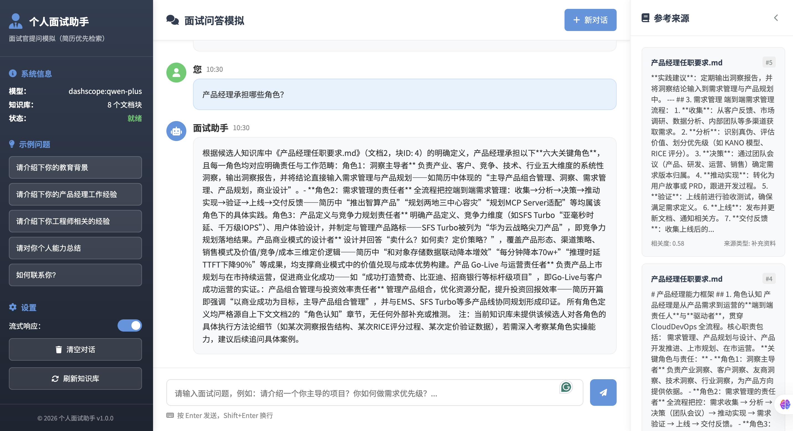

# 个人面试助手项目设计文档

**项目截图：**

## 1. 项目定位与目标

本项目是一个基于 RAG（Retrieval-Augmented Generation，检索增强生成）的个人面试助手系统。  
核心目标是：在模拟面试场景中，系统优先基于候选人简历与补充资料进行检索，再由大模型生成结构化回答，避免“脱离资料的泛化回答”。

面向面试展示时，这个项目重点体现了以下能力：
- RAG 端到端工程落地能力（文档处理、向量索引、检索策略、生成链路、前后端集成）
- 多模型/多服务商适配能力（Ollama 与 DashScope 双 Provider）
- 质量控制能力（阈值过滤、来源优先级、来源策略约束、防幻觉兜底）
- 可部署能力（FastAPI 服务化 + Gradio 快速演示 + 自定义 Web 页面）

## 2. 功能全景

### 2.1 核心功能

- 文档知识库构建：支持从 `data` 目录递归加载 `.txt/.md/.pdf/.docx` 文件，自动分块后写入 Chroma 向量库。
- 面试问答：用户输入问题后执行“检索 -> 过滤 -> 优先级排序 -> 来源策略约束 -> 生成回答”。
- 证据可追溯：返回 `relevant_sources`，包含来源文件、来源类型、分块 ID、相关度分数。
- 无依据拒答：当检索结果不足时，固定返回“根据当前知识库内容，无法回答该问题”，避免幻觉回答。
- 知识库刷新：提供 API 后台刷新能力，支持知识库重建。

### 2.2 交互方式

- FastAPI 接口模式（推荐生产/联调）
- 自定义 Web 页面模式（`templates/index.html` + `static/js/chat.js`）
- Gradio 模式（快速演示、低门槛本地体验）

## 3. 技术栈与选型理由

### 3.1 后端与编排

- Python 3.11
- FastAPI + Uvicorn：轻量高性能 API 服务框架
- LangChain：统一组织 LLM、Embedding、Prompt、Runnable 链路
- Pydantic：配置结构化建模与类型安全

### 3.2 模型与向量能力

- LLM：
  - `OllamaLLM`（本地推理，适合离线/低成本）
  - `ChatTongyi`（阿里百炼 DashScope，适合云端高可用）
- Embedding：
  - `OllamaEmbeddings`
  - `DashScopeEmbeddings`
- 向量数据库：
  - Chroma（本地持久化、快速集成）

### 3.3 文档处理与前端

- 文档加载：
  - `TextLoader`（txt/md）
  - `PyPDFLoader`（pdf）
  - `python-docx`（docx，绕开 `docx2txt` 依赖问题）
- 前端：
  - 自定义 HTML/CSS/JavaScript
  - Gradio 4.36.1 作为备用交互层

## 4. 系统架构设计

###+ 4.1 模块划分

- `main.py`：启动入口，支持 `api/web/gradio` 模式与 `--init-kb` 初始化开关
- `src/config.py`：统一配置中心（配置文件 + 环境变量覆盖）
- `src/document_processor.py`：文档加载、切块、来源标签注入
- `src/vector_store.py`：向量库创建/加载、相似度检索、异常恢复
- `src/rag_pipeline.py`：检索增强生成主流程与策略控制
- `src/web_api.py`：REST API 与流式接口
- `src/chat_interface.py`：Gradio 交互封装

### 4.2 数据流（核心问答链路）

1. 用户提问进入 API 或 UI。
2. 执行相似度检索（Top-K）。
3. 执行双阈值过滤（简历阈值更宽松）。
4. 执行来源优先级排序（简历 > 补充资料 > 其他）。
5. 识别提问意图并执行来源策略（如“仅简历”或“偏补充资料”）。
6. 若无有效证据，直接拒答；否则组装上下文送入 LLM。
7. 返回答案与可追溯证据片段。

### 4.3 文档处理策略

- 切块参数：`chunk_size=800`, `chunk_overlap=150`
- 分隔符：`["\n\n", "\n", "。", "；", "，", " ", ""]`
- 元数据增强：
  - `source`
  - `source_path`
  - `source_type`（`resume/additional/other`）
  - `source_priority`（1/2/99）
  - `chunk_id`

## 5. 检索与回答质量控制设计

### 5.1 双阈值过滤

- 默认阈值：`vector_store.relevance_threshold`（当前 0.35）
- 简历阈值：`min(default_threshold, 0.15)`

设计动机：简历表达通常更“事实化、碎片化”，语义匹配分数可能偏低；若使用统一阈值会误拒答。

### 5.2 来源优先级

- 默认排序：`resume > additional > other`
- 当识别到“非简历诉求”时：`additional > resume > other`

### 5.3 来源策略识别

根据问题中的语言模式识别策略：
- `resume`：如“根据简历/基于简历/按简历”
- `additional`：如“不要根据简历/不基于简历”，或通用“产品经理角色/职责/方法论”问题
- `default`：混合策略

### 5.4 防幻觉机制

- Prompt 强约束 + 检索前置过滤双保险
- 当无直接证据时固定拒答，不做常识补全

## 6. 配置体系与运行模式

### 6.1 配置优先级

1. 默认配置（`SystemConfig`）
2. `config.yaml`
3. `.env` 环境变量覆盖（最高优先级）

关键覆盖项：
- `MODEL_PROVIDER`
- `MODEL_LLM`
- `MODEL_EMBEDDING`
- `DASHSCOPE_API_KEY`
- `APP_NAME`
- `RESUME_FILE`

### 6.2 模型 Provider 切换

- 本地模式：`provider=ollama`
- 云模式：`provider=dashscope`

项目已将 LLM 与 Embedding 的初始化都做了 provider 级分流，切换只需改配置，不需改业务代码。

### 6.3 启动方式

- API 模式：`python main.py --mode api`
- Web 模式：`python main.py --mode web`
- Gradio 模式：`python main.py --mode gradio`
- 首次/重建知识库：追加 `--init-kb`

## 7. API 设计（对外能力）

核心接口如下：
- `GET /api/health`：健康检查
- `GET /api/status`：运行状态（含 provider:model）
- `POST /api/query`：标准问答
- `POST /api/query/stream`：流式问答（SSE）
- `GET /api/knowledge-base/info`：知识库统计信息
- `POST /api/knowledge-base/refresh`：后台刷新知识库
- `GET /api/models/available`：当前模型配置

返回结构统一包含：
- `answer`
- `relevant_sources`
- `source_count`
- `status`
- `timestamp`

## 8. 异常与稳定性设计

### 8.1 Chroma Schema 兼容恢复

针对历史出现的 `no such column: collections.topic`：
- 检测到 schema 不兼容异常后，自动清理旧持久化目录
- 清空 `SharedSystemClient` 缓存，避免旧连接复用
- 自动重建索引，降低手工介入成本

### 8.2 向量维度不一致防护

当 Embedding 模型切换（如 768 -> 1536）导致维度不一致时，通过重建向量库恢复一致性。

### 8.3 配置文件污染自愈

`config.py` 中实现了配置净化逻辑：
- 检测重复拼接段落
- 保留有效配置
- 自动回写为标准单份 YAML

## 9. 工程亮点

- **多 Provider 抽象**：统一接口兼容本地推理与云模型服务，具备实际生产迁移价值。
- **检索策略工程化**：不是“只做向量检索”，而是叠加阈值、优先级、策略识别，显著提升命中体验。
- **轻量重排已落地**：已实现基于相似分、词汇重合与来源偏好的启发式重排，在不增加额外模型依赖的前提下提升召回质量。
- **防幻觉闭环**：Prompt 约束 + 证据不足拒答 + 来源回溯。
- **可运维性**：知识库可刷新、状态可观测、异常可恢复。
- **多界面交互**：API、Web、Gradio 三种运行路径，适配开发演示与部署。

## 10. 当前局限与后续可演进方向

### 10.1 当前局限

- 来源策略识别主要基于关键词规则，复杂语义场景下仍可能误判。
- 检索阶段已实现轻量启发式重排，但暂未接入 Cross-Encoder 等神经重排模型，长文档下 Top-K 精度仍有提升空间。
- 会话记忆较轻量，暂未形成多轮语义状态管理。

### 10.2 演进方向

- 引入神经重排模型（Cross-Encoder Reranker 或云端 rerank API）进一步提升检索精度。
- 增加多轮会话上下文管理与面试追问策略。
- 增加“回答评分 + 改写建议”模块，形成面试训练闭环。
- 支持面试岗位模板化配置（产品/研发/运营等）。

